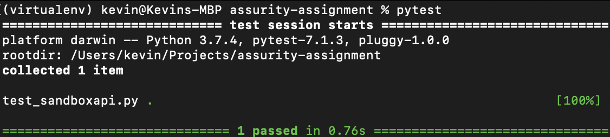

# Assurity assignment 

This repository is my proposed solution to the assignment given to me by Assurity for my application of Senior Test Engineer.

The assignment is as follows: 

"Using the API given below create an automated test with the listed acceptance criteria:"

**API**  =  [https://api.tmsandbox.co.nz/v1/Categories/6327/Details.json?catalogue=false](https://api.tmsandbox.co.nz/v1/Categories/6327/Details.json?catalogue=false)

**Acceptance Criteria**:

-   Name = "Carbon credits"
-   CanRelist = true
-   The  Promotions  element with  Name = "Gallery" has a Description that contains the text "Good position in category"

I have chosen to write the solution in python, as it is my go-to programming language for assignments like this. It does not require heavy-weight editors, and I find the time-to-hello-world to be one of the lowest. 

# Install guide

This repository requires python3, preferably version 3.3 or higher. Because the python 'venv' (virtualenv) module is included with the installation. Otherwise you have to install it yourself. I have written this code on a macbook with python 3.7.4

https://www.python.org/downloads/

Also an installation of git is required.

https://git-scm.com/book/en/v2/Getting-Started-Installing-Git

## Short guide
Linux/Mac:
```
% cd /project/path/of/your/choosing
% git clone https://github.com/kevindeboer/assurity-assignment
% python -m venv /venv/path/of/your/choosing/venvkevin
% source /venv/path/of/your/choosing/venvkevin/bin/activate
(venvkevin) % pip install -r requirements.txt
(venvkevin) % pytest
(venvkevin) % deactivate
% ...
```

Windows (I could not test this myself):
```
> cd c:\project\path\of\your\choosing
> git clone https://github.com/kevindeboer/assurity-assignment
> c:\path\to\python -m venv c:\venv\path\of\your\choosing\venvkevin
> c:\venv\path\of\your\choosing\venvkevin\Scripts\activate.bat
(venvkevin) > pip install -r requirements.txt
(venvkevin) > py.test
(venvkevin) > deactivate
> ...
```

## Long guide
### Getting the repository

Clone this repository in a directory of your choosing from a command line using the command: 

`git clone https://github.com/kevindeboer/assurity-assignment`

### Installing dependencies
Virtualenv is python's solution to separating project dependencies to avoid version conflicts and pollution of your global python installation. It is highly recommended to use one for every project, but it is still optional.

To create a virtualenv (I use the name 'venvkevin' in this guide, but you can choose something else if you want) in a terminal window (assuming python version >3.3):

Linux/Mac: `python3 -m venv /path/to/venvkevin`  
Windows: `path\to\python -m venv c:\path\to\venvkevin`

Alternatively, if you configured the  `PATH`  variable (https://docs.python.org/3/using/windows.html#using-on-windows):

`c:\>python -m venv c:\path\to\venvkevin`

This will create a new directory where new dependencies will be installed to. You can delete this directory when you're done examining this project. It is recommended to not create the virtualenv directory in the same repository as the project, or at least configure the repository to not push the virtualenv directory to the remote repository, as the virtualenv directory may quickly explode in size due to dependencies requiring other dependencies which require other dependencies which require...

After creating the virtualenv directory, you then have to activate it. Navigate to the created directory, then:  
Linux/Mac: `source venvkevin/bin/activate`  
Windows: `venvkevin\Scripts\activate.bat`

Finally, after having activated the virtualenv, which should be visible by the (venvkevin) in front command line, navigate back to the project, and install the the dependencies using python's package manager 'pip':  
`pip install -r requirements.txt`

You should now be good to go.

When you are finished, use `deactivate` in the terminal to deactivate the virtualenv (or close the terminal completely). 

# Executing code

From the root of the repository, run (with virtualenv still activated):  
Linux/Mac: `pytest`  
Windows: `py.test`

This should give a result like



# Project layout
```
root/
    assurity/
        api.py  // reuseable class for interacting the webservice
        config.py // configurable base url
    README.md  // this file
    requirements.txt // contains project dependencies
    test_assurity.py // contains the test
```
# Approach

After deciding on python, I immediately knew I would want to use the `requests` and `pytest` modules. Even though python has its own built-in functions for doing http calls, and making tests. These two packages are widely used within the python community, and some may even consider them the new standard. I also have more experience working with these frameworks rather than the built-in ones.

Secondly I expected I would have required some sort of JSONPath module in order to extract the expected criteria from the JSON response. However while writing the code I found that the built-in json module was sufficient enough for this case, and decided not to use a separate module for this.

Before writing the test, I first needed some code to make the call to the webservice. I created a class in `api.py` for this; `SandboxAPI`. This class can potentially be reused in other tests, or in ad hoc scripts when you want to call the webservice outside the scope of a test. For example when you're just 'trying stuff' to try to reproduce a vague production issue. 

I have separated the base url in `config.py` to make it easier for when you may want to run a test against a different server, environment, or local port. 

Then finally, in the test I use my `SandboxAPI` class to call the webservice. I assert that its response is 200. If not, there is no point in trying to compare values of the json. Then I parse the json response, extract the values to be checked, and verify each in an assert statement.

I could've cut up the test in to three separate tests. That would show more features of the pytest framework, and show more reusability of the coe. But if the only use of writing more code would be to illustrate the resusability of it, then in this case I would favor 'less is more'. As a compromise I instantiate the `SandboxAPI` through a a pytest fixture. Which allows it to be reused in other test functions, even though at this point there is no real need for it yet.

And by focussing on making the test run from the command line, it would make it easier to execute it in a ci/cd pipeline


